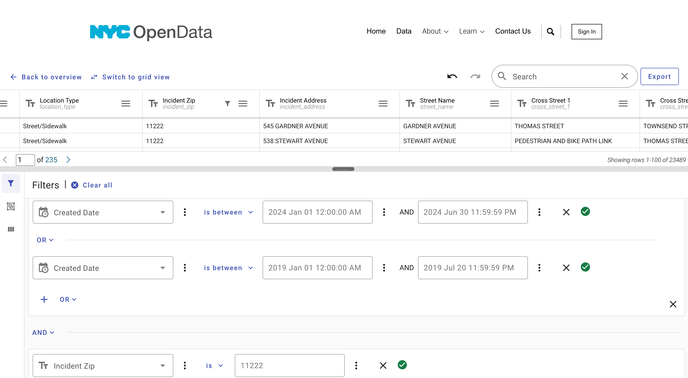
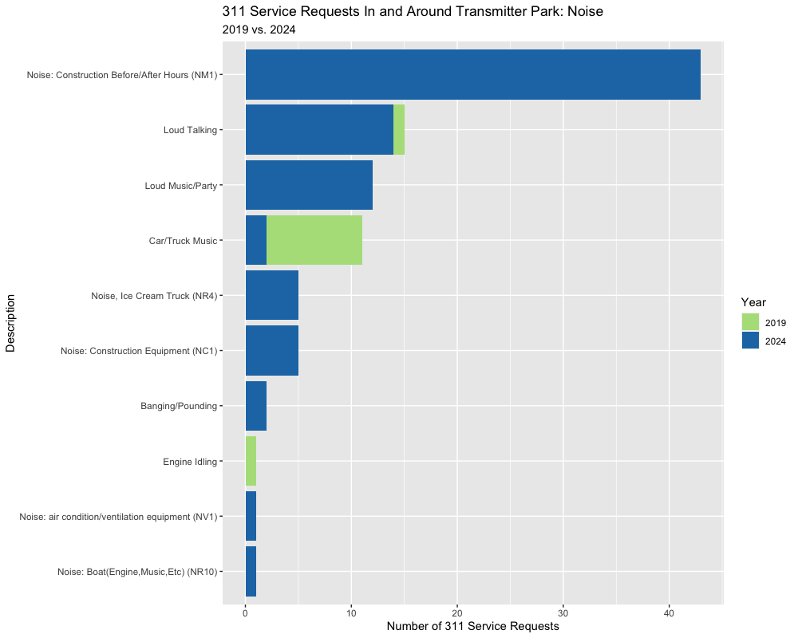
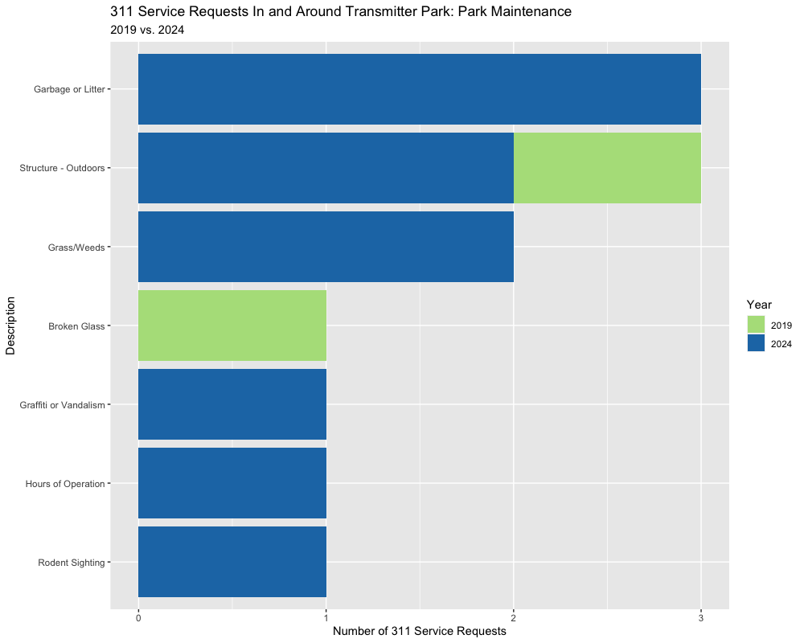
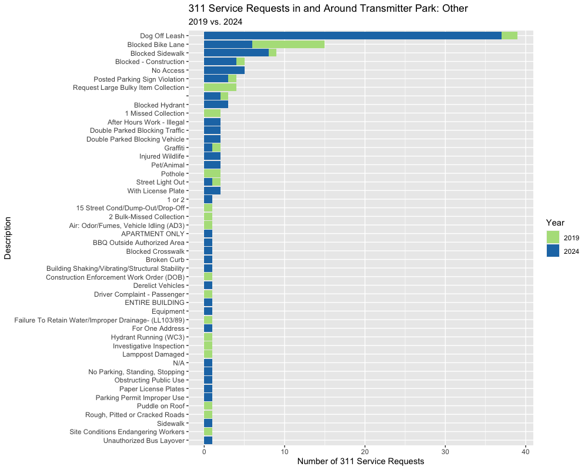

```{r, libs, include=FALSE}
library(tidyverse)
library(magrittr)
library(sf)
library(lubridate)
library(kableExtra)
library(janitor)

knitr::opts_knit$set(root.dir = '/Users/andysworld/Dropbox (Personal)/beta-nyc')

local({
  hook_output <- knitr::knit_hooks$get('output')
  knitr::knit_hooks$set(output = function(x, options) {
    if (!is.null(options$max.height)) options$attr.output <- c(
      options$attr.output,
      sprintf('style="max-height: %s;"', options$max.height)
    )
    hook_output(x, options)
  })
})

options(width = 3000)
```
# Data Download and Processing

Our goal is to compare 311 calls in and around Transmitter Park in Greenpoint, Brooklyn during two time periods: January 1st to June 30th 2019, and January 1st to June 30th 2024. 

A dataset of 311 service requests from 2010-present is available on [NYC Open Data](https://data.cityofnewyork.us/Social-Services/311-Service-Requests-from-2010-to-Present/erm2-nwe9/about_data). The dataset is extremely large with approximately 34 million rows. In order to more easily work with the dataset, it is possible to perform a preliminary query to reduce the size of the downloaded data by eliminating irrelevant records.

Since we are only interested in two time periods confined to a park in a single neighborhood, we may filter the records by created date (`Created.Date`) and zip code (`Incident.Zip`).

The GUI can be used to create a filter equivalent to a boolean expression:



Once the 311 calls have been limited to the period and zip code of interest, they may be used for further analysis. The data used for this analysis is located at `data/311-greenpoint.csv`.  311 calls without coordinate values are removed:


```{r, message = FALSE, warning = FALSE}
# Set working directory
wd <- "/Users/andysworld/Dropbox (Personal)/beta-nyc"
setwd(wd)

# Read CSV of Greenpoint 311 calls during two study periods
# Filter records missing coordinates
gp_311 <- read.csv("data/311-greenpoint.csv") %>% filter(!is.na(X.Coordinate..State.Plane.) & 
                                                           !is.na(Y.Coordinate..State.Plane.))

```

Our study area is limited to the area in and around Transmitter park. More specifically, we are interested in the area between Greenpoint Ave & Kent Ave along West Street. 

According to [its codebook](https://data.cityofnewyork.us/api/views/erm2-nwe9/files/b372b884-f86a-453b-ba16-1fe06ce9d212?download=true&filename=311_ServiceRequest_2010-Present_DataDictionary_Updated_2023.xlsx), the 311 dataset includes fields for incident street name (`Street.Name`), and cross streets (`Cross.Street.1` and `Cross.Street.2`). One method to filter 311 service requests in the study area is to limit those with the expected attributes:

```{r}
gp_311 %>%
  filter(Street.Name == "WEST STREET" &
         Cross.Street.1 == "GREENPOINT AVENUE" &
         Cross.Street.2 == "KENT STREET") %>%
  count()
```

However, this strict filtering only returns five records. A more general approach is to filter 311 service requests from distance to Transmitter Park. The eastern edge of West Street is approximately 325 feet from the eastern edge of the park on Greenpoint Avenue:


We may then choose to include those service requests falling within 325 feet of the boundary of the park.The boundary of Transmitter Park can be obtained from the [parks properties dataset](https://data.cityofnewyork.us/Recreation/Parks-Properties/enfh-gkve/about_data) on NYC Open Data. Each 311 service request has coordinate pairs in NY State Plane and Latitude/Longitude which may be used to locate them. An intersection operation between the buffer and the 311 calls returns only calls within the buffer.

```{r, warning = FALSE, message=FALSE}
# Read park boundaries
nyc_parks <- st_read("data/parks-properties.geojson",
                     quiet = TRUE)

# Return only transmitter park
# Transform CRS to NY State Plane, feet
tm <- nyc_parks %>% 
  filter(str_detect(name311, "Transmitter")) %>%
  st_transform(2263)

# Convert Greenpoint 311 Calls dataframe to SF object with matching CRS
gp_311 <- st_as_sf(gp_311,
                   coords = c("X.Coordinate..State.Plane.",
                              "Y.Coordinate..State.Plane."),
                   crs = 2263)

# Create 325ft buffer around park
tm_325 <- st_buffer(tm, dist = 325)

# Perform intersection of park buffer and 311 calls
tm_311 <- st_intersection(gp_311, tm_325)
```

A visual representation of Transmitter Park, its 325-foot buffer, and 311 calls located within the buffer:

**Note: The Github version of this notebook does not permit interactive HTML elements**

```{r, warning=FALSE, message=FALSE}
library(tmap)

# Select basemaps
tmap_options(basemaps = c("Esri.WorldTopoMap","OpenStreetMap"))

# Switch to interactive output
tmap_mode("view")

# Add layers
tm_shape(tm_325) +
  tm_borders()+
tm_shape(tm)+
  tm_fill(col = "#33a02c",
          alpha = 0.9)+
tm_shape(tm_311) +
  tm_dots()
```

The reason for each 311 service request is described by unique combinations of the `Complaint.Type` and `Descriptor` fields. The complete list of unique combinations is available in the 311 service request [data dictionary](https://data.cityofnewyork.us/api/views/erm2-nwe9/files/b372b884-f86a-453b-ba16-1fe06ce9d212?download=true&filename=311_ServiceRequest_2010-Present_DataDictionary_Updated_2023.xlsx).

We are broadly interested in comparing requests based on noise, trash, and parks maintenance between the two time periods. The values in the `Complaint.Type` field can be used to categorize each call into "Noise", "Trash", "Parks Maintenance", or "Other". Different types of complaints are handled by different city agencies:

* Noise
  * Complaint Type is "Noise" (DEP)
  * Complaint.Type contains "Noise" (Many agencies)
* Trash (Not including park maintenance)
  * Complaint type is "Debris" (DOB)
  * Complaint type is "Hazardous Material" or "Industrial Waste" (DEP)
  * Complaint type is "Rodent" (DOHMH)
  * Complaint type is "Dirty Condition" (DoS)
  * Complaint type is "Litter Basket Complaint" (DoS)
  * Complaint type is "Illegal dumping" (DoS)
* Call for park maintenance
  * Complaint is "Maintenance or Facility" (DPR)

```{r}
# Define values which count as trash complaints
trash_list <- c("Debris",
                "Hazardous Material",
                "Industrial Waste",
                "Rodent",
                "Dirty Condition",
                "Litter Basket Complaint",
                "Illegal Dumping")

# Create new variable for analysis category
tm_311$call_cat <- NA

# Assign category variable value
tm_311 <- tm_311 %>%
  mutate(call_cat = case_when(str_detect(Complaint.Type, "Noise") ~ "Noise",
                              Complaint.Type == "Maintenance or Facility" ~ "Parks Maintenance",
                              Complaint.Type %in% trash_list ~ "Trash")) %>%
  relocate(call_cat, .after = Descriptor) %>%
  mutate(call_cat = replace_na(call_cat, "Other"))

# Add year column
tm_311 <- tm_311 %>%
  mutate(year = year(mdy_hms(Created.Date))) %>%
  relocate(year, .after = Closed.Date)

tm_311 %>% 
  st_drop_geometry() %>%
  count()
```

248 service records are returned based on location.

```{r, include=FALSE} 
# tm_311 %>%
#   filter(year == 2019) %>%
#   ggplot() +
#   geom_bar(aes(call_cat)) +
#   labs(title = "311 Calls In and Around Transmitter Park",
#        subtitle = "2019: January 1 to June 30",
#        y = "Count",
#        x = "Complaint Type")
# 
# 
# tm_311 %>%
#   filter(year == 2024) %>%
#   ggplot() +
#   geom_bar(aes(call_cat)) +
#   labs(title = "311 Calls In and Around Transmitter Park",
#        subtitle = "2024: January 1 to June 30",
#        y = "Count",
#        x = "Complaint Type")
```

Each service request category can be compared by year: 

```{r, message = FALSE, out.width="80%"}
tm_311_summary <- tm_311 %>% 
  st_drop_geometry() %>%
  group_by(year, call_cat) %>%
  summarize(Count = n()) %>%
  ungroup() %>%
  pivot_wider(names_from = year,
              values_from = Count) %>%
  mutate(`2019` = replace_na(`2019`, 0)) %>%
  rename(`Call Category` = "call_cat") %>%
  adorn_totals(where = "row")

tm_311_summary  %>%
  kbl() %>%
  kable_classic() %>%
  row_spec(5, bold = T)

```

The number of 311 service requests during January 1 - June 30 increased from 50 in 2019 to 198 in 2024, a 296% increase. Further comparison of each category may be performed:

# Noise
```{r, out.width="100%"}
library(forcats)
library(RColorBrewer)
colors <- c("2024" = "#1f78b4",
            "2019" = "#b2df8a")

noise <- tm_311 %>%
  filter(call_cat == "Noise") %>%
  group_by(year) %>%
  ggplot() +
  geom_bar(aes(y = fct_rev(fct_infreq(Descriptor)), fill = as.character(year)))+
  scale_fill_manual(values = colors) +
  labs(fill = "Year",
       x = "Number of 311 Service Requests",
       y = "Description",
       title = "311 Service Requests In and Around Transmitter Park: Noise",
       subtitle = "2019 vs. 2024")
```


As seen in the table above, noise-related 311 calls increased from 11 to 85. In 2024, the majority of noise-related calls were due to construction noise outside of permitted hours. No complaints for this issue were recorded in 2019. The majority of noise-related 311 calls in 2011 were for music from cars or trucks, the number of which decreased in 2024.

# Trash

Trash-related that were not associated with park maintenance requests were not recorded during the study period in 2019. In 2024, four were received -- One each for chronic dumping, a rat sighting, a trash removal request, and for trash itself.

```{r}
tm_311 %>%
  st_drop_geometry() %>%
  filter(call_cat == "Trash") %>%
  select(Descriptor) %>%
  group_by(Descriptor) %>%
  summarize(Count = n()) %>%
  adorn_totals(where = "row") %>%
  kbl() %>%
  kable_classic() %>%
  row_spec(5, bold = T)
```

# Park Maintenance Requests
```{r}
trash <- tm_311 %>%
  filter(call_cat == "Parks Maintenance") %>%
  group_by(year) %>%
  ggplot() +
  geom_bar(aes(y = fct_rev(fct_infreq(Descriptor)), fill = as.character(year)))+
  scale_fill_manual(values = colors) +
  labs(fill = "Year",
       x = "Number of 311 Service Requests",
       y = "Description",
       title = "311 Service Requests In and Around Transmitter Park: Park Maintenance",
       subtitle = "2019 vs. 2024")
```


Requests for park maintenance increased from 2 in 2019 to 10 in 2024. In 2024, three maintenance requests were received for garbage or litter, two each were received related to outdoor structures and weeds/grass, and one each was received for graffiti/vandalism, hours of operation, and a rodent sighting. In 2019, only two maintenece requests were received for an outdoor structure and for broken glass.  

```{r, warning=FALSE, message=FALSE, include=FALSE}
#Completion time (though maybe not relevant)
# parks_work_orders <- read_csv("data/parks-work-orders.csv")
# 
# tm_311_parks <- tm_311 %>%
#   filter(call_cat == "Parks Maintenance") %>%
#   mutate(Unique.Key = as.character(Unique.Key)) %>%
#   left_join(parks_work_orders, by = join_by(Unique.Key == EVT_UDFCHAR16))
```

# Other

In both 2019 and 2024, 311 service requests based on trash, noise, or parks maintenance did not make up the majority of calls. The number of other calls increased from 37 in 2019 to 99 in 2024.

```{r}
other <- tm_311 %>%
  filter(call_cat == "Other") %>%
  group_by(year) %>%
  ggplot() +
  geom_bar(aes(y = fct_rev(fct_infreq(Descriptor)), fill = as.character(year)))+
  scale_fill_manual(values = colors) +
  labs(fill = "Year",
       x = "Number of 311 Service Requests",
       y = "Description",
       title = "311 Service Requests in and Around Transmitter Park: Other",
       subtitle = "2019 vs. 2024")
```



Among 311 calls with counts greater than or equal to five, the number of calls related to off-leash dogs, blocked sidewalks, blockages due to construction, and access restriction increased from 2019 to 2024. Reports of blocked bike lanes decreased.

# Assumptions and limitations

Only two approaches to filtering 311 records are presented here -- neither is perfect. The choice of filtering method necessarily impacts the results of this analysis. Further work to identify an optimal filtering approach which does not eliminate relevant records would be appropriate to inform policy decisions.